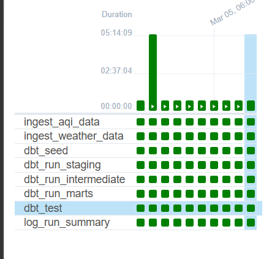
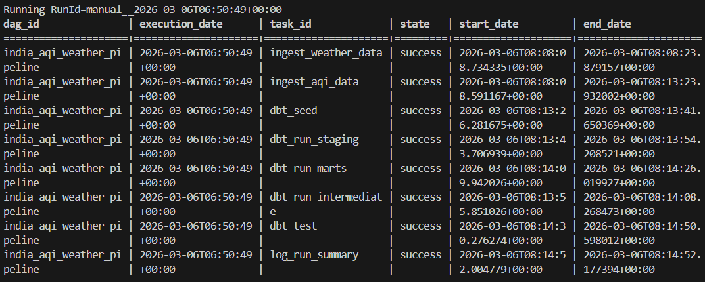
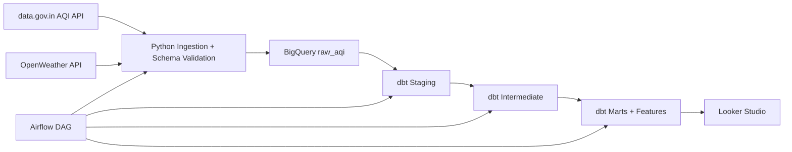

# India AQI Weather Pipeline

India has a documented air quality crisis, but raw AQI and weather data are split across systems and formats.  
This project builds an API-first data platform to answer a practical question:
does rainfall, wind, and humidity materially improve city AQI, and for how long?

## Problem Statement

The pipeline correlates hourly AQI readings from government monitoring stations with weather conditions to produce analytics tables, quality metrics, and dashboard outputs that are reproducible and operationally monitored.

## Proof It Works

- Airflow DAG runs are completing end-to-end with all tasks green.
- dbt stages, marts, and tests execute inside Airflow successfully.
- BigQuery loads both valid and quarantined records on each ingestion run.

Recent successful run IDs:

- `manual__2026-03-06T06:37:30+00:00`
- `manual__2026-03-06T06:44:47+00:00`
- `manual__2026-03-06T06:48:30.343437+00:00`
- `manual__2026-03-06T06:49:22+00:00`

Artifacts to add:

- Airflow green DAG screenshot: `docs/screenshots/airflow_dag_grid.png`
- dbt test output screenshot: `docs/screenshots/dbt_test_pass.png`
- BigQuery row-count screenshot: `docs/screenshots/bigquery_row_counts.png`
- Looker Studio dashboard URL: `TODO_ADD_LINK`

## Pipeline Runs - Proof of Work

### DAG Grid - All Tasks Successful


### Task-Level State Output


Latest successful run date: `2026-03-06`  
Representative run ID: `manual__2026-03-06T06:50:49+00:00`  
Full pipeline duration: about 5 minutes (`05:14:09` longest observed in UI)

Task flow:

- `ingest_aqi_data`
- `ingest_weather_data`
- `dbt_seed`
- `dbt_run_staging`
- `dbt_run_intermediate`
- `dbt_run_marts`
- `dbt_test`
- `log_run_summary`

All tasks: `success`

## Architecture



If you want a static diagram image, export and place it at `docs/architecture.png`.

## What It Does

1. Ingests AQI readings from 150+ monitoring stations across India (~4,000 records/day) from data.gov.in (CPCB resource API).
2. Ingests weather data from OpenWeatherMap.
3. Validates records and quarantines schema/type failures (~3-8% of records/day, primarily missing PM2.5 values or invalid station IDs).
4. Loads raw data to BigQuery (`raw_aqi`).
5. Builds staging, intermediate, mart, and feature tables with dbt (`dbt_aqi`), including daily AQI summaries, city-level rankings, and ML-ready feature vectors with 14 engineered features.
6. Runs quality tests and pipeline-health metrics.
7. Orchestrates the full flow in Airflow.

## Data Sources and Real-World Data Issues

AQI API (data.gov.in):

- Pollutant-wise rows, not one wide row per station-hour.
- `last_update` requires timestamp parsing and normalization.
- Missing/invalid values appear and must be quarantined.

Weather API (OpenWeatherMap):

- City-level weather snapshot per fetch.
- Rain key is optional (`rain.1h` missing on non-rain events).
- City names may not exactly match AQI city naming; mapping is required.

## Challenges and Fixes

- Scraping instability pivot:
  scraper approach was dropped in favor of API-only ingestion for reliability and compliance.
- Docker credential visibility:
  mounted `credentials.json` into Airflow containers and used container path for ADC.
- Timestamp join mismatch:
  truncated timestamps to hour (`DATE_TRUNC`) before AQI-weather join.
- Backfill restartability:
  added checkpoint file flow (`completed_dates.txt`) to resume interrupted backfills.
- Queued runs confusion:
  documented that `None` task states usually indicate queued runs under `max_active_runs=1`.

## Tech Stack

- Python 3.11 (local)
- requests, pandas, python-dotenv
- Google BigQuery
- dbt Core + dbt-bigquery
- Apache Airflow 2.8 (Docker Compose)
- Docker

## Project Structure

```text
airflow/
  dags/aqi_pipeline_dag.py
  Dockerfile
ingestion/
  aqi_ingestion.py
  weather_ingestion.py
  schema_validator.py
  bq_loader.py
  utils.py
dbt_project/
  models/
  seeds/
  tests/
scripts/
  backfill_aqi.py
  backfill_weather.py
docs/
  ERRORS.md
  DECISIONS.md
  LEARNINGS.md
  PRODUCTION_GAPS.md
  DEVLOG.md
data/
  cities.json
docker-compose.yml
```

## Setup

1. Copy `.env.example` to `.env`.
2. Fill required env vars:
   - `GCP_PROJECT_ID`
   - `DATA_GOV_API_KEY`
   - `OPENWEATHER_API_KEY`
   - `GOOGLE_APPLICATION_CREDENTIALS` (container path is mounted automatically)
3. Place `credentials.json` in repo root.
4. Ensure BigQuery datasets exist:
   - `raw_aqi`
   - `dbt_aqi`

## Run Locally (without Airflow)

```bash
python ingestion/aqi_ingestion.py
python ingestion/weather_ingestion.py
cd dbt_project
dbt seed --profiles-dir .
dbt run --profiles-dir .
dbt test --profiles-dir .
```

## Run with Airflow

```bash
docker compose up -d
docker compose exec airflow-webserver airflow dags trigger india_aqi_weather_pipeline
docker compose exec airflow-webserver airflow dags list-runs -d india_aqi_weather_pipeline --no-backfill
```

Inspect a specific run:

```bash
docker compose exec airflow-webserver airflow tasks states-for-dag-run india_aqi_weather_pipeline manual__2026-03-06T05:31:48+00:00
```

PowerShell helper (latest running run):

```powershell
$rid=(docker compose exec airflow-webserver airflow dags list-runs -d india_aqi_weather_pipeline --no-backfill | Select-String "running" | Select-Object -First 1).ToString().Split("|")[1].Trim(); Write-Host "RunId=$rid"; docker compose exec airflow-webserver airflow tasks states-for-dag-run india_aqi_weather_pipeline $rid
```

Airflow UI: `http://localhost:8080` (`airflow` / `airflow`)

## DAG Tasks

- `ingest_aqi_data`
- `ingest_weather_data`
- `dbt_seed`
- `dbt_run_staging`
- `dbt_run_intermediate`
- `dbt_run_marts`
- `dbt_test`
- `log_run_summary`

## dbt Layering (Why 3 Layers)

Staging is a 1:1 copy of source tables with standardized naming and light cleaning only, and business logic is intentionally excluded.  
Intermediate is where joins and transformation logic live, including AQI + weather integration and reusable derived fields.  
Marts are final, query-optimized analytical tables built for reporting and downstream consumers.  
Feature marts provide ML-ready vectors (14 engineered features) for model training and scoring workflows.

## Data Quality Controls

- Pre-load schema validation for ingestion.
- Quarantine table: `raw_aqi.invalid_records`.
- dbt tests for nulls, category validity, future timestamps, and freshness.
- Mart-level quality metrics via `mart_data_quality_metrics`.

## Production Improvements

- Use dbt incremental models for large historical volumes.
- Move secrets to GCP Secret Manager instead of local file mounting.
- Add Slack/email alerting for task failures and quality threshold breaches.
- Publish dbt docs with model and column lineage.

## Backfill

AQI:

```bash
python scripts/backfill_aqi.py --start 2024-01-01 --end 2024-03-01
```

Weather:

```bash
python scripts/backfill_weather.py --start 2024-01-01 --end 2024-03-01
```
